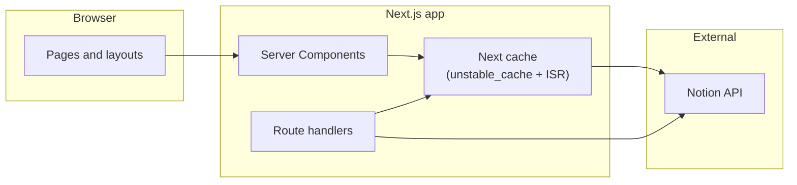

# Design

This document describes how **nublson-v3** is structured: architecture, content model, caching, and UI conventions. It is meant for contributors and future refactors—not end users.

## Purpose

A personal site for **work**, **blog**, and **about** content. Copy and structure live primarily in **Notion**; Next.js fetches via the Notion API, renders React Server Components, and exposes RSS feeds, sitemaps, and Open Graph metadata.

## Tech stack

| Layer | Choice |
|--------|--------|
| Framework | [Next.js](https://nextjs.org/) 16 (App Router) |
| UI | React 19, Server Components by default |
| Styling | Tailwind CSS 4, CSS variables for theming |
| Components | [shadcn/ui](https://ui.shadcn.com/) (style: **radix-nova**, base color **neutral**) |
| Icons | Lucide React, Remix Icon where needed |
| Content API | `@notionhq/client` |
| Block rendering | `@9gustin/react-notion-render` + custom blocks in `src/components/content-blocks.tsx` |
| Theme | `next-themes` (class-based, system default) |
| Fonts | Geist Sans / Geist Mono (`next/font/google`) |
| Tests | Vitest + Testing Library |

Package manager: **pnpm** (see `package.json`).

## High-level architecture

- **All Notion reads** go through `src/services/notion.tsx` (plus formatters in `src/utils/formatter.ts`).
- **Block trees** are fetched with bounded concurrency (`src/lib/map-pool.ts`) and depth limits to respect Notion rate limits and payload size.
- **On-demand updates** use `POST /api/revalidate` to invalidate cached Notion data or specific paths (see [Cache and revalidation](#cache-and-revalidation)).

## Repository layout

| Path | Role |
|------|------|
| `src/app/` | App Router: routes, `layout.tsx`, `loading.tsx`, route handlers (`feed.xml`, `api/revalidate`), SEO helpers (`sitemap.ts`, `robots.ts`) |
| `src/app/_components/` | Route-local components for home, about, blog listing, work listing |
| `src/app/blog/[slug]/`, `src/app/work/[slug]/` | Dynamic entries + co-located `_components/` |
| `src/components/` | Shared UI: header, footer, notion-driven content blocks, skeletons |
| `src/sections/` | Larger compositions (e.g. main content section wrapping Notion render) |
| `src/services/notion.tsx` | Notion client, queries, caching wrappers |
| `src/lib/` | Shared utilities (`cn`, `map-pool`) |
| `src/utils/` | Formatters, metadata builders, RSS helpers |
| `components.json` | shadcn config (aliases, Tailwind entry: `src/app/globals.css`) |

Path alias: `@/*` → `src/*` (`tsconfig.json`).

## Routing map

| URL | Source |
|-----|--------|
| `/` | Home: hero + projects + posts from Notion |
| `/about` | About page blocks from Notion |
| `/blog` | Blog index |
| `/blog/[slug]` | Blog post (content DB, `Media = Blog`) |
| `/work` | Work index |
| `/work/[slug]` | Work entry (`Media = Project`) |
| `/feed.xml` | Combined RSS |
| `/blog/feed.xml`, `/work/feed.xml` | Section RSS |
| `POST /api/revalidate` | Cache invalidation (secret query param) |

## Content model (Notion)

The app expects **Notion databases** and **fixed pages** referenced by environment variables (see `.env.example`).

### Published rows

Indexed content is queried with filters aligned to `src/services/notion.tsx`:

- **`Media`** (select): `Blog` or `Project`—separates blog posts vs. portfolio work in the shared content database.
- **`State`** (select): `Done`—only published items appear in listings, feeds, and static params.

Posts are sorted by **`Publish Date`** (descending). Metadata such as title, description, dates, and thumbnails is normalized in `src/utils/formatter.ts` (`formatPostMetadata`, etc.).

### Slugs

Default slug behavior is derived from the page **title** (see formatter). Optionally, set **`NOTION_SLUG_PROPERTY`** to a rich_text property name on the database so slug lookup uses a filtered query instead of scanning pages.

### Static page IDs

Hero and SEO for section roots use single Notion pages:

- `NOTION_PAGE_HOME_ID`, `NOTION_PAGE_ABOUT_ID`, `NOTION_PAGE_WORK_ID`, `NOTION_PAGE_BLOG_ID`

`metadataFromNotionPageId` in `src/utils/metadata.ts` loads cover images and titles from those pages.

### Environment variables

| Variable | Purpose |
|----------|---------|
| `BASE_URL` | Canonical site URL (metadata, RSS links) |
| `NOTION_ACCESS_TOKEN` | Notion integration token |
| `NOTION_DATABASE_CONTENT_ID` | Main database for blog + work entries |
| `NOTION_DATABASE_GEARS_ID` | Reserved for future / gears content (see `.env.example`) |
| `NOTION_PAGE_*` | Notion page IDs for static sections |
| `NOTION_SLUG_PROPERTY` | Optional: rich_text property for URL slugs |
| `REVALIDATION_SECRET` | Shared secret for `POST /api/revalidate` |

## Cache and revalidation

### Route segment config

Several routes set `export const revalidate = 10` (seconds ISR). Adjust per route if you need fresher or cheaper builds.

### Tagged cache for blocks

`getPageBlocks` wraps recursive block fetching in `unstable_cache` with tag **`notion-blocks`** and the same revalidate window. Listing queries use React `cache()` for deduplication within a request.

### Webhook-style refresh

`POST /api/revalidate`:

- Query: `?secret=<REVALIDATION_SECRET>`
- Body (optional JSON): `{ "type": "blog" \| "work", "slug": "..." }` revalidates that post path.
- Without a targeted slug: **`revalidateTag("notion-blocks")`** and **`revalidatePath("/", "layout")`** for a broad refresh.

Wire this URL from Notion automations or your deployment pipeline when content changes.

## UI and theming

- **Shell**: `Header`, `Footer`, `SkipLink`, main landmark `#main-content` in `src/app/layout.tsx`.
- **Dark mode**: `ThemeProvider` from `next-themes`; `.dark` variant defined in `globals.css`.
- **Design tokens**: shadcn/Tailwind theme via CSS variables (`--background`, `--primary`, `--radius`, etc.) in `src/app/globals.css`; chart and sidebar tokens are present for shadcn component compatibility.
- **Wrapper layout**: Pages use a `.wrapper` class for horizontal rhythm (see layout/main).

Prefer existing primitives under `src/components/ui/` when adding interactive UI.

## SEO and feeds

- **Metadata**: `generateMetadata` / `metadataFromNotionPageId` / `buildShareMetadata` for titles, descriptions, images, article times.
- **Structured data**: JSON-LD components for posts (`blog-json-ld`, `work-json-ld`, site `WebSite` in layout).
- **Discovery**: `sitemap.ts`, `robots.ts`, RSS builders in `src/utils/rss.ts`.
- **Images**: Remote patterns for Notion and common hosts are listed in `next.config.ts` under `images.remotePatterns`.

## Testing

- `pnpm test` — Vitest unit tests (`*.test.ts` / `*.test.tsx`).
- `pnpm type-check` — TypeScript.
- `pnpm lint` — ESLint (Next.js config).

Add tests beside the module (`map-pool.test.ts`, `formatter.test.ts`, etc.).

## Related docs

- Next.js behavior in this repo may differ from older majors; check `node_modules/next/dist/docs/` when upgrading or using new APIs.
- `README.md` in this repository is a GitHub profile readme, not project runbook—use `package.json` scripts and `.env.example` for local setup.
